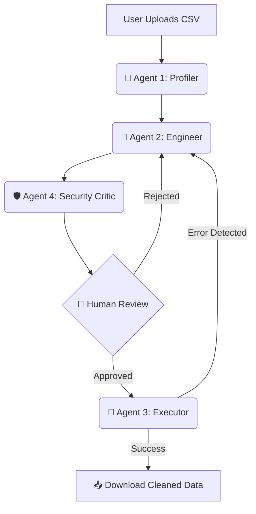

# 🏭 Agentic-Cleanse Factory
### *Autonomous Multi-Agent ETL Orchestration with Self-Healing Logic*

---

## 🚀 Overview
**Agentic-Cleanse Factory** is a sophisticated multi-agent system designed to transform messy, "real-world" datasets into analysis-ready assets. Built on a **Directed Acyclic Graph (DAG)** architecture using **LangGraph**, the system coordinates specialized AI agents to analyze, code, secure, and execute data-engineering tasks with zero manual coding required from the user.

## 🧠 System Architecture
The factory utilizes a four-node assembly line where state is passed and validated at every step:

The Worker Agents:

The Profiler (Analyzer): Conducts deep inspection of schema, null distributions, and data types to create a cleaning strategy.

The Engineer (Coder): Generates optimized Python/Pandas logic. It is Context-Aware—if a previous attempt fails, it analyzes the traceback to self-correct.

The Security Critic (Veto): Acts as a sandbox guard, scanning AI-generated code for dangerous system calls (e.g., os.remove) before execution.

The Executor (Runner): Handles the physical execution in a controlled environment and verifies the integrity of the output file.

✨ Enterprise Features

Self-Healing Loops: If the Executor catches a runtime bug, the error is fed back to the Engineer for an autonomous repair attempt.

Circuit Breaker Logic: Prevents infinite loops by limiting autonomous retries to 3 attempts.

Human-in-the-Loop (HITL): Utilizes LangGraph Checkpoints to pause execution, requiring the user to approve the AI-generated code.

Comparison Dashboard: Displays "Before vs. After" metrics, tracking null-count reduction and schema improvements.

🛠️ Tech Stack

Orchestration: LangGraph (StateGraph)

LLM Power: Llama 3.3-70b (via Groq Cloud)

UI Framework: Streamlit

Data Analysis: Pandas, Numpy

Observability: LangSmith (Tracing & Debugging)

---

## 🎓 About the Developer
I am a Data Science Graduate Student at **The University of Texas at Arlington (UTA)**. This project demonstrates the intersection of Software Engineering, Cybersecurity, and Large Language Model (LLM) orchestration.

**Connect with me:**
* 💼 [LinkedIn](https://www.linkedin.com/in/dhrumil-rana-25a774211/)
* 📧 [Gmail](mailto:dhrumil@uta.edu)
* 🐙 [GitHub](https://github.com/dhrumilrana25)
